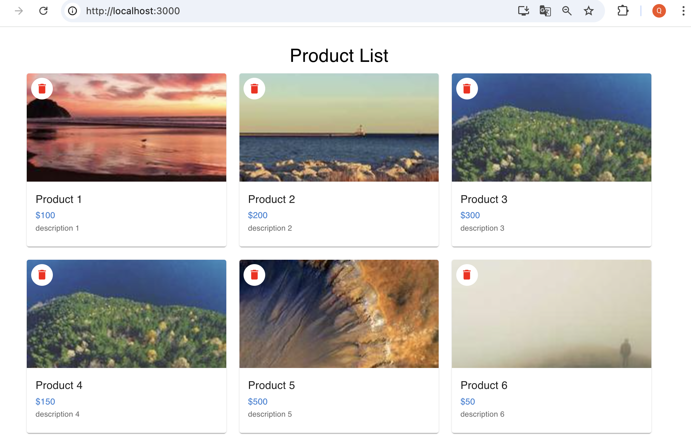

# Simple Product Card List App

A full-stack web app that displays a list of products in card format, allowing users to delete and reset products. Built with React + Material UI on the frontend, and Node.js + Express on the backend.



## Features

- View products in Material UI cards
- Delete products (frontend + backend synced)
- Reset product list to initial state
- Responsive layout
- Random image loading from Picsum


## Setup Instructions 

### 1. Clone this repo 

```bash
git clone https://github.com/qianhuazhou/product-card-app.git
cd product-card-app
```

### 2. Install and start backend 

```
cd backend
npm install
node index.js
```

> The backend will run on `http://localhost:5001`

### 3. Install and start frontend 

```
cd frontend
npm install
npm start
```

> The frontend will run on `http://localhost:3000`

Make sure `frontend/package.json` has the following:

```
"proxy": "http://localhost:5001"
```


